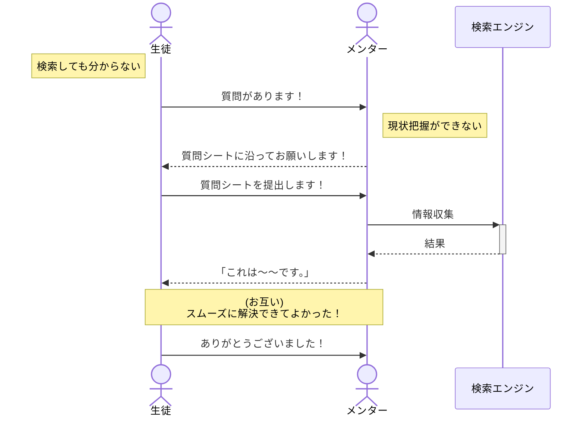
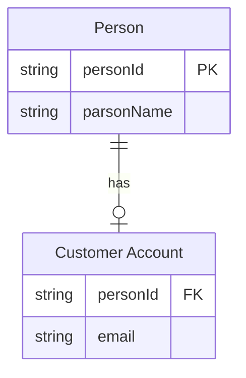
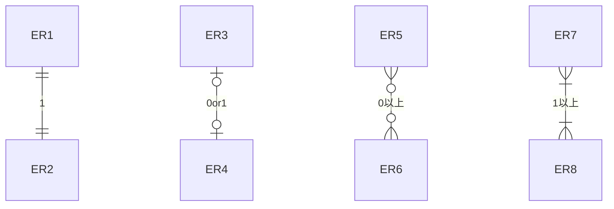

```mermaid
%% 最初に何の図を書くのか指定する
sequenceDiagram
%% オブジェクト名を指定
    actor s as 生徒
    actor m as メンター
    participant 検索エンジン

%% 左にメモを追加
    Note left of s :検索しても分からない
%% やり取りを書く
    s->>m: 質問があります！
    Note right of m:現状把握ができない
    m-->>s:　質問シートに沿ってお願いします！
    s->>m: 質問シートを提出します！
    m->>+検索エンジン:情報収集
    検索エンジン-->>-m:結果
    m-->>s:「これは～～です。」
    Note over s,m:(お互い)<br/>スムーズに解決できてよかった！
    s->>m: ありがとうございました！
```

```mermaid
erDiagram
    p[Person] {
        string personId PK
        string parsonName
    }
    a["Customer Account"] {
        string personId FK
        string email
    }
    p ||--o| a :has
```

```mermaid
erDiagram
    ER1 ||--|| ER2: "1"
    ER3 |o--o| ER4: "0or1"
    ER5 }o--o{ ER6: "0以上"
    ER7 }|--|{ ER8: "1以上"
```

